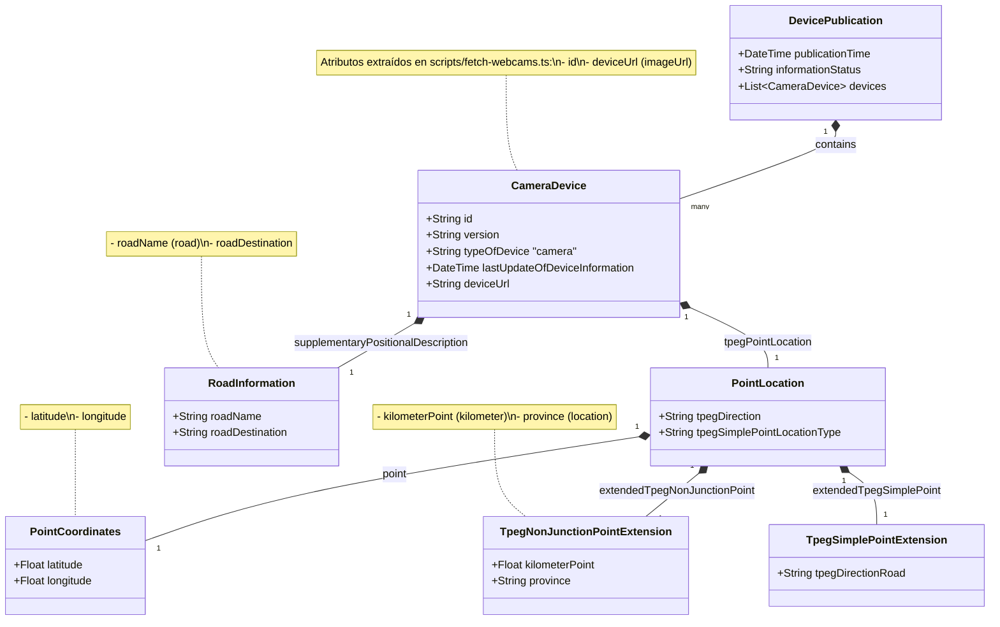
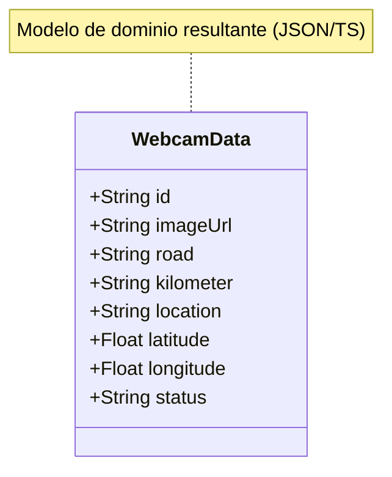

# Diagrama de Entidad Cámara (DGT XML DATEX II)

A continuación, se presenta un diagrama de clase basado en la estructura de datos que proviene de la fuente de tráfico de la DGT (DATEX II v3.6) para las cámaras.

Este modelo refleja los atributos disponibles en el XML (nodo `ns2:device`) y cómo los mapeamos conceptualmente.

## Mapeo al tipo de la aplicación ([WebcamData](file:///c:/Users/Yago/WebstormProjects/expo-android-project-3/scripts/fetch-webcams.ts#7-17) / [Cam](file:///c:/Users/Yago/WebstormProjects/expo-android-project-3/types/cam.ts#1-13))

A partir de toda esta información del árbol XML, la aplicación extrae un modelo simplificado y plano:

